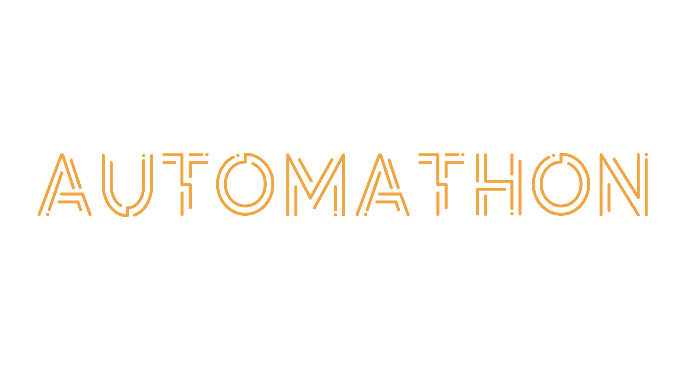

# Automathon 2024



Bienvenue, ce hackathon vise à vous former à la Detection de DeepFakes


## Setup DGX

Une fois que nous vous avons donné vos accès DGX et vos clés SSH dans le dossier `compteX`

Il faut suivre les instructions suivantes:

1. Lancer le script

```bash
cd compte8
python3 dgx_setup.py
```

*Note: le numero 8 est un exemple, mettez votre numero d'equipe*

Le script tourneras et vous donnera votre mot de passe.

```
Your password is jbk47rgdfEFH
```

*Note: ce mot de passe est purement ficitf*

2. Essayez de vous connecter

```bash
ssh dgx
```
A ce moment il vous demandera votre mot de passe

3. Changez votre mot de passe de compte

Une fois connectés changez votre mot de passe a quelquechose d'autre

```bash
passwd
Old Password: <PASSWORD>
New password: <PASSWORD>
```

## Setup Local

1. Connectez vous à Github

Après vous être assurés que nous avons bel et bien pris votre compte Github, cliquez sur le bouton ci-dessous pour ouvrir une nouvelle fenetre de navigation dans laquelle vous pouvez ensuite se connecter a votre compte Github.

[](https://github.com/)

2. Creez vos propres clés SSH

Si vous n'avez pas encore de clé SSH executez:

```bash
ssh-keygen
```

3. Mettez vos clés SSH personelles dans votre compte Github

[](https://github.com/settings/keys)

vous pouvez trouver vos clés avec la commande suivante:

```bash
cat ~/.ssh/id_rsa.pub
```

4. Clonez le repo

```
git clone git@github.com:Automatants/automathon-2024.git
```

5. Rentrez dans l'environnement virtuel

```bash
cd automatonhackathon-2024
source .venv/bin/activate
```

À tout moment, pour ressortir de  l'environnement virtuel executez:

```bash
deactivate
```

5. Installez les dependances du projet

```bash
pip install -r requirements.txt
```

## Usage

Le repo possède 2 fichiers:

1. Un `baseline.ipynb` qui sert à expliquer des details du dataset, et sert au tests locaux

2. un `run.py` qui sert a executer le projet sur DGX

Pour faire tourner le run.py, connectez vous à la DGX:

```bash
ssh dgx
cd automatonhackathon-2024
git pull
./run
```


